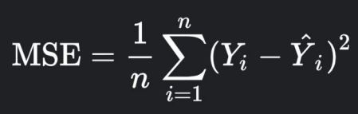
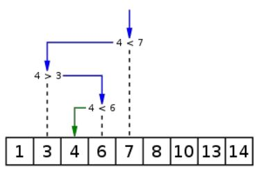

# Урок 6. Парадигмы программирования на практике. Подведение итогов курса

## Classwork

### task001:

● Контекст
В каждом телефоне есть это замечательное приложение.
Секундомер - это программа, которая засекает сколько
времени прошло от момента запуска до момента остановки.
Также, как правило там присутствует функция “паузы”,
которая позволяет временно приостановить секундомер, с
возможностью продолжить отсчет в будущем.
● Ваша задача
Реализовать секундомер на любом языке программирования
в любой парадигме. Секундомер должен поддерживать
следующий функционал:
○ Запуск
○ Пауза
○ Выход из паузы
○ Остановка

### task002:

● Контекст
Предположим, у нас есть модель, которая предсказывает прогноз продаж, и теперь мы хотим оценить
насколько модель точно это делает. Для получения оценки “точности” модели можно использовать
много разных метрик. Одна из популярных метрик - это “среднеквадратичная ошибка” (mean squared
error или MSE).
● Пусть у нас есть два массива длины n: один с предсказаниями нашей модели - Ŷ, а другой с истиной
(правильными ответами) - Y. Тогда можно вычислить MSE по простой формуле.
● Ваша задача:

Реализовать процедуру для вычисления MSE на любом языке в любой парадигме. Программа получает
на вход два вектора и возвращает число - оценку MSE для этих векторов.

### task003:

Сортировка слиянием
Контекст
Ещё один известный и довольно эффективный алгоритм
сортировки массива - сортировка слиянием (merge sort).
Алгоритм делится на два этапа:
○ этап разбиения - массив разбивается на пару
массивов до тех пор пока, полученные массивы не
станут массивами длины 1 (состоящими из одного
элемента).
○ этап слияния - соединяем пары массивов в большие
массивы так, чтобы полученные массивы были
отсортированы.
● Ваша задача
Реализовать сортировку слиянием на любом языке в любой
парадигме. На вход ваша программа получает массив из
чисел, а вернуть должна отсортированный массив.

## Homework

### task001:

Бинарный поиск
Контекст
Предположим, что мы хотим найти элемент в массиве (получить
его индекс). Мы можем это сделать просто перебрав все элементы.
Но что, если массив уже отсортирован? В этом случае можно
использовать бинарный поиск. Принцип прост: сначала берём
элемент находящийся посередине и сравниваем с тем, который мы
хотим найти. Если центральный элемент больше нашего,
рассматриваем массив слева от центрального, а если больше -
справа и повторяем так до тех пор, пока не найдем наш элемент.

● Ваша задача
Написать программу на любом языке в любой парадигме для
бинарного поиска. На вход подаётся целочисленный массив и
число. На выходе - индекс элемента или -1, в случае если искомого
элемента нет в массиве.
